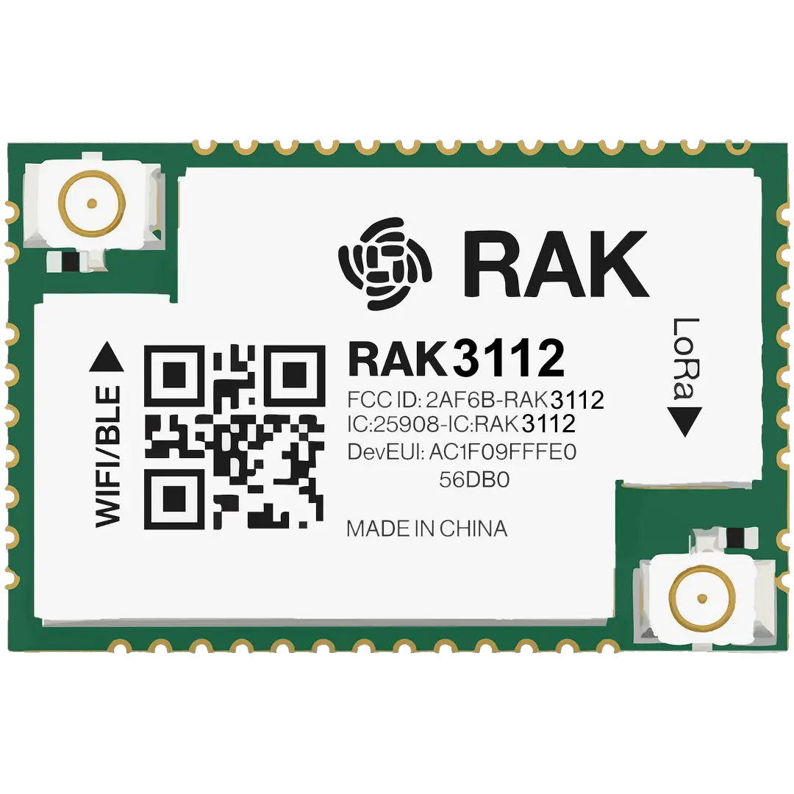

.. zephyr:board:: rak3112

Overview
********

RAK3112 is a WisDuo module which integrating an ESP32-S3 16MB of flash chip
together with a Semtech SX1262 LoRa® transceiver. This module is ideal for
various IoT applications such as home automation, sensor networks, building
automation, and other IoT network applications and AI applications.

Hardware
********

The breakout board supports LoRa, WiFi and BLE. USB interface of the module
is used for programming and debugging.

ESP32-S3 is a low-power MCU-based system on a chip (SoC) with integrated
2.4 GHz Wi-Fi and Bluetooth® Low Energy (Bluetooth LE). It consists of
high-performance dual-core microprocessor (Xtensa® 32-bit LX7), a low power
coprocessor, a Wi-Fi baseband, a Bluetooth LE baseband, RF module,
and numerous peripherals.

Based on Espressif ESP32-S3:
- Xtensa® 32-bit LX7 dual-core microprocessor
- 16 MB Flash
- 512 kB SRAM
- 512 kB RAM
- 8 MB PSRAM
- 16 kB RTC SRAM
- Wi-Fi 802.11b/g/n
- Bluetooth LE 5.0 with long-range support and up to 2Mbps data rate

LoRa transceiver Semtech SX1262:
- LoRa and LoRaWAN support
- Frequency support from 863 MHz to 928 MHz

For more information about the RAK3112 stamp module:

- `WisDuo RAK3112 Website`_
- `ESP32-S3 on www.espressif.com`_

Supported Features
==================

.. zephyr:board-supported-hw::

Prerequisites
-------------

Espressif HAL requires WiFi and Bluetooth binary blobs in order work.
Run the command below to retrieve those files.

.. code-block:: console

   west blobs fetch hal_espressif

.. note::

It is recommended running the command above after :file:`west update`.

Building & Flashing
*******************

.. zephyr:board-supported-runners::

Simple boot
===========

The board could be loaded using the single binary image, without 2nd stage bootloader.
It is the default option when building the application without additional configuration.

.. note::

   Simple boot does not provide any security features nor OTA updates.

Manual build
============

During the development cycle, it is intended to build & flash as quickly possible.
For that reason, images can be built once at a time using traditional build.

Build and flash applications as usual (see :ref:`build_an_application` and
:ref:`application_run` for more details).

.. zephyr-app-commands::
   :zephyr-app: samples/hello_world
   :board: rak3112/esp32s3/procpu
   :goals: build flash

Open the serial monitor using the following command:

.. code-block:: shell

   west espressif monitor

After the board has automatically reset and booted, you should see the following
message in the monitor:

.. code-block:: console

   ***** Booting Zephyr OS vx.x.x-xxx-gxxxxxxxxxxxx *****
   Hello World! rak3112

Debugging
*********

ESP32-S3 support on OpenOCD and it is available at `OpenOCD ESP32`_.

ESP32-S3 has a built-in JTAG circuitry and can be debugged without
any additional chip. Only an USB cable connected to the D+/D- pins is necessary.

Further documentation can be obtained from the SoC vendor
in `JTAG debugging for ESP32-S3`_.

Here is an example for building the :zephyr:code-sample:`hello_world` application.

.. zephyr-app-commands::
   :zephyr-app: samples/hello_world
   :board: rak3112/esp32s3/procpu
   :goals: build flash

You can debug an application in the usual way. Here is an example for
the :zephyr:code-sample:`hello_world` application.

.. zephyr-app-commands::
   :zephyr-app: samples/hello_world
   :board: rak3112/esp32s3/procpu
   :goals: debug

References
**********

.. target-notes::

.. _WisDuo RAK3112 Website:
   https://docs.rakwireless.com/product-categories/wisduo/rak3112-module/overview/

.. _ESP32-S3 on www.espressif.com:
   https://www.espressif.com/en/products/socs/esp32-s3

.. _`ESP32-S3 Datasheet`:
   https://www.espressif.com/sites/default/files/documentation/esp32-s3-mini-1_mini-1u_datasheet_en.pdf

.. _`ESP32-S3 Technical Reference Manual`:
   https://www.espressif.com/sites/default/files/documentation/esp32-s3_technical_reference_manual_en.pdf

.. _`OpenOCD ESP32`:
   https://github.com/espressif/openocd-esp32/releases

.. _`JTAG debugging for ESP32-S3`:
   https://docs.espressif.com/projects/esp-idf/en/latest/esp32s3/api-guides/jtag-debugging/
